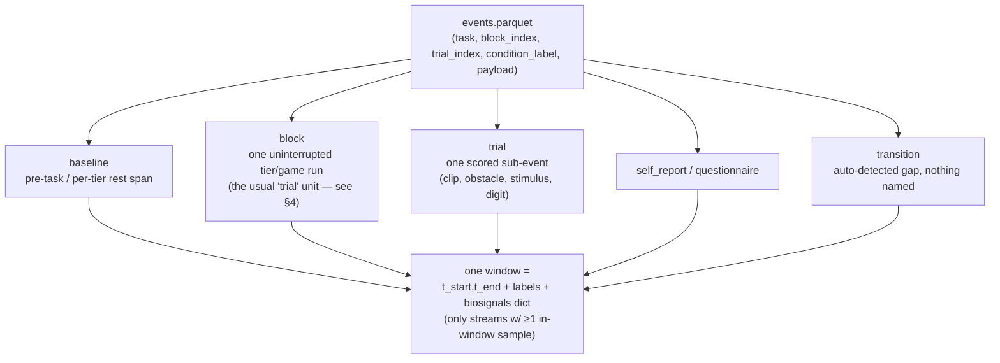
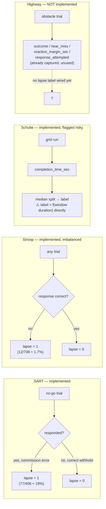

# EEG Foundation-Model Label Design

Status: **draft for discussion**, 2026-08-19. Companion to `PROGRESS.md` and
`docs/Dataset_Sync_Design.md` (§8-9) — this doc exists to lay the same
information out visually so the focus/attention labeling decisions can be
discussed with a colleague before `export_npy.py`'s label scheme is
finalized.

## 1. Data collection pipeline (Windows PC, `stress-emotion-attention-v1` branch)

Devices are synced and started via three external scripts *before* the task
app starts (confirmed by the `device_sync_skipped` event — `app/sync/*.py`
in this repo is not what ran for real sessions). The task app's own event
log (`events.jsonl`, already host UTC) starts last and is the master
timeline every device stream gets pulled onto.

```mermaid
flowchart LR
  subgraph DEV["Data collection · Windows PC"]
    A1["Out-ear EEG<br/>ADS1299 · 8ch · 250Hz<br/>(mandatory)"]
    A2["In-ear EEG<br/>ADS1299 · 8ch · 250Hz<br/>(optional device)"]
    A3["In-ear PPG/IMU/MLX/BME<br/>100Hz/100Hz/1Hz/1Hz"]
    B1["Wristband<br/>PPG/IMU/GSR 200Hz · MAG 100Hz · MLX/BME 1Hz"]
    C1["Polar H10<br/>ECG 130Hz · ACC 200Hz"]
    D1["Task app event log<br/>events.jsonl (host UTC, master timeline)"]
  end
  DEV --> SYNC["dataset/sync.py<br/>per-stream wall-clock anchoring"]
  SYNC --> BUILD["dataset/build_dataset.py"]
  BUILD --> PARQ[("Canonical Parquet<br/>per participant · per stream<br/>+ events.parquet + sync_report.json")]
  PARQ --> WIN["dataset/windows.py<br/>event-windowed extraction"]
  WIN --> TDS["EventWindowDataset<br/>(torch_dataset.py)"]
  WIN --> NPY["export_npy.py<br/>fixed-shape .npy per task"]
  NPY --> MODELS["CBraMod / REVE / etc."]
```

## 2. Streams captured per participant

| Device | Sensor | Channels | Rate | Availability |
|---|---|---|---|---|
| Out-ear EEG | ADS1299 | 8 | 250 Hz | Mandatory — present for all 12 participants |
| In-ear EEG | ADS1299 | 8 | 250 Hz | Optional device — substitutable via `--eeg-stream ear_eeg_in.ads1299` |
| In-ear PPG | MAX30101 | red/IR/green | 100 Hz (configured; observed under-delivering for at least P007) | Optional |
| In-ear IMU | BMI270 | accel+gyro | 100 Hz | Optional |
| In-ear temp | MLX90632 | IR temp | 1 Hz | Optional |
| In-ear env | BME680 | pressure/humidity/gas | 1 Hz | Optional |
| Wristband PPG | MAX30105 | red/IR/green | 200 Hz | Per-session |
| Wristband IMU | BMI270 | accel+gyro | 200 Hz | Per-session |
| Wristband GSR | analog EDA | 1 | 200 Hz | Per-session |
| Wristband MAG | BMM350 | 3 | 100 Hz | Per-session |
| Wristband temp/env | MLX/BME | 1 each | 1 Hz each | Per-session |
| Polar H10 | ECG | 1 | 130 Hz (fixed by device) | Per-session |
| Polar H10 | ACC | 3 | 200 Hz | Per-session |
| Event log | task software | — | event-driven | Always — master timeline |

Sync anchors differ per device family (fixed boot offset for ear-EEG, fixed
offset from a `SYNC_MS` handshake for wristband, affine offset+drift fit
from repeated checkpoints for Polar H10) — see `Dataset_Sync_Design.md` §2
for the exact formulas; not reproduced here since it's not decision-relevant
to labeling.

## 3. Windowing: how raw streams become one training sample

Nothing is windowed by fixed sliding time — windows are **event-defined**,
one per task-defined trial/block/baseline/self-report/questionnaire, using
each task's own logged event boundaries. The complement (anything between
labeled windows) is auto-captured as `"transition"` gap windows, so no time
is silently dropped.

For each window, `export_npy.py` divides `[t_start, t_end]` into `T` equal
segments (T chosen ≈ median real duration in seconds per task, so ~1
segment/real-second), each resampled onto a 200-point grid — giving a fixed
`X: (B, C=8, T, 200)` float32 array per task, with `y: (B,)` int64 labels,
`0` always reserved for baseline/rest.

## 4. Per-task input → current label mapping

| Task | Unit exported as "trial" | T (baseline T) | Current `y` label | Label source | Circularity risk |
|---|---|---|---|---|---|
| Emotion | clip (`window_type="trial"`) | 68 (15) | 1/2/3 = negative/neutral/positive | **Design** — stimulus valence group | None |
| Math / raindrop | tier run (`"block"`) | 60 (10) | 1/2/3 = tier 1/2/3 | **Design** — assigned difficulty tier | None |
| Highway | tier run (`"block"`) | 61 (5) | 1/2/3 = tier 1/2/3 | **Design** — assigned difficulty tier | None — but no lapse label yet (§5) |
| Stroop | stimulus (`"trial"`) | 1 (10) | 1/2 = incongruent/congruent | **Design** — stimulus identity | None, but answers "what stimulus," not "was participant attending" |
| Stroop **lapse** | stimulus, truncated to end 0.15s pre-click | 1 | 0 = attentive (correct) / 1 = lapse (incorrect) | **Behavior** — response correctness | Guarded by truncation, but only 12/708 errors (~1.7%) — too imbalanced alone |
| Schulte | grid run (`"block"`) | 26 (10) | 1/2 = slower/faster than **cohort-wide median** completion time | **Behavior** — performance split | **Sharpest risk**: label is a direct function of the window's own duration (unresolved, §5) |
| SART | digit (`"trial"`) | 1 (30) | 1/2 = go/no-go | **Design** — stimulus identity | None, but answers "what stimulus," not "was participant attending" |
| SART **lapse** | no-go digits only, truncated to end 0.15s pre-response | 1 | 0 = attentive (correct withhold) / 1 = lapse (commission error) | **Behavior** — Robertson et al. 1997 definition | Guarded by truncation; well-populated (77/406, ~19%, matches literature) |

## 5. Focus / attention tasks — the part to discuss

This is the open decision: **is a behavior-derived "attention" label even
the right target**, or should some tasks stay design-labeled only? Three
different modeling goals are being conflated in places and imply different
label choices:

1. *Classify task condition* (e.g. Stroop congruency, SART stimulus type) — already done, safe, but not really an "attention" claim.
2. *Classify attention state* (lapse vs. attentive) — implemented for SART/Stroop only, each with its own imbalance/circularity tradeoff.
3. *Predict error probability* — a regression/soft framing nobody has committed to yet.

### What's already captured but not yet turned into a label

| Task | Signal sitting in raw events / window metadata, unused as a label | Notes |
|---|---|---|
| Highway | Per-obstacle `outcome`, `near_miss`, `reaction_margin_sec`, `response_attempted` (already in `Window.labels`); per-tier `avoided`/`collisions` tallies (in `Window.meta`); continuous `focus_lost`/`focus_regained` telemetry (raw events only, no window) | Most natural highway "lapse" candidate = a collision, or `response_attempted=False` |
| Raindrop / math | `wrong_submission` events (keystroke resets) — not paired into windows at all | No `trial_index` on these events currently, so pairing needs new logic |
| Schulte | `misclicks` (a count, duration-independent) already sits in the same `labels_json` as `completion_time_sec` | Flagged in `Dataset_Sync_Design.md` §9 as the cleaner alternative split variable |
| Stroop | Only correctness used; RT (`rt_ms`) not used for a "slow-but-correct" borderline-lapse definition | Could enlarge the positive class beyond the 1.7% hard-error rate |

### Known data-quality caveat relevant to any highway label

The first 4 participants collected (before a same-day fix on 2026-08-13)
have `attention_highway` trial counts inflated ~30-100% by an obstacle-
scoring bug (`concurrent_obstacles == lanes` caused double-counted,
perfectly-overlapping hazards). Any collision-based lapse label must
either exclude or correct these participants — check `notes/notes.txt` for
the exact affected list.

## 6. Open questions to bring to the discussion

1. **Target framing** — pick one (or state that it varies by task): *task condition* vs. *attention state* vs. *error probability*. Determines whether design-only labels (safe, already done) are sufficient, or genuine behavior-derived lapse labels are required per task.
2. **Schulte's circularity** — `completion_time_sec` directly determines the label, and duration is not independent of the resampled `(T, 200)` grid. Options: keep as-is with a documented caveat, switch the split variable to `misclicks` (duration-independent), or drop Schulte lapse/performance labels entirely and keep only... there is no design-assigned condition for Schulte, so "drop" means EEG-only unlabeled export for that task.
3. **Highway and raindrop have no lapse label at all yet.** Need to define what "lapse" means for a continuous avoidance game (collision? no-response-attempted?) and a timed arithmetic task (wrong submission?), then wire the already-captured `outcome`/`near_miss` (highway) or the currently-unpaired `wrong_submission` events (raindrop) into new window-builder functions.
4. **Stroop's 1.7% positive class** — (a) fall back to congruency when class balance matters more than lapse-specificity [current recommendation], (b) keep the imbalance and handle it with class weighting downstream, or (c) define a softer "borderline lapse" (e.g. slow-but-correct RT outlier) to enlarge the positive class.
5. **0.15s pre-response truncation buffer** — currently one literature-informed constant shared by SART and Stroop. Worth validating against this cohort's own motor-preparation/readiness-potential timing, or tuning per-task/per-participant, instead of assuming it generalizes.
6. **Cross-stream labels** — `export_npy.py` now exports EEG + 6 wristband modalities per file key. Should a wristband-derived signal (e.g. GSR arousal) ever inform or cross-validate a label, or should wristband data stay a purely independent input stream while labels always come from the task/EEG side?

## 7. Other reliability caveats worth keeping in view

- Ear-EEG channels frequently rail at ±8,388,608 (ADS1299 24-bit saturation) — electrode contact, not a parsing bug; affects usable channel count per window.
- P007's in-ear PPG ran far below its configured 100 Hz (2,878 records over ~2,963s) — worth checking across other in-ear sessions before training on that stream.
- Polar checkpoint-fit residuals run ~20ms mean / ~70-95ms max — within expected range, tracked per participant in `sync_report.json`.
