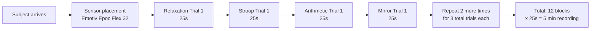
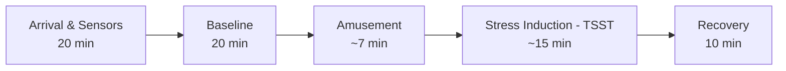

Let me read both papers directly for the full protocol details.

Here's a detailed breakdown of how both datasets were collected, with the full experimental protocols.

---

## SAM40 — Ghosh et al. 2022

**Reference**: [SAM 40: Dataset of 40 subject EEG recordings to monitor induced-stress](https://doi.org/10.1016/j.dib.2021.107772), *Data in Brief* 40, 2022

### The Core Design

SAM40 uses a **within-subject repeated-measures** design: every participant cycles through four different tasks, each repeated in **3 trials of 25 seconds**, giving 12 recording blocks per person.

### The Four Tasks

| Task | Duration | Trials | Description |
|------|----------|--------|-------------|
| **Stroop Color-Word Test (SCWT)** | 25 s | 3 | Classic Stroop — color names printed in incongruent ink colors; subject must name the ink color, not the word |
| **Arithmetic Task** | 25 s | 3 | Solving arithmetic questions under time pressure |
| **Mirror Image Recognition** | 25 s | 3 | Identifying symmetric mirror images |
| **Relaxation** | 25 s | 3 | State of relaxation (no active task) |

Each trial is **exactly 25 seconds** recorded at **128 Hz**, yielding **3200 time steps per trial** per channel.

### EEG Setup

| Aspect | Detail |
|--------|--------|
| **Device** | Emotiv Epoc Flex 32 |
| **Channels** | 32 scalp electrodes, placed according to the International 10–20 system |
| **Sampling rate** | 128 Hz |
| **Subjects** | 40 (14F, 26M, mean age 21.5 years) |

### Protocol Flow

The tasks were presented in sequence, and the cycle (Relaxation → Stroop → Arithmetic → Mirror) was repeated **3 times** per subject. Each 25-second window is treated as one trial.

### Labeling Scheme

- **Relaxed** (120 trials total: 40 subjects × 3 relaxation trials)
- **Stressed** (360 trials total: 40 subjects × 3 stress-inducing tasks × 3 trials each)

The three stress tasks are collapsed into a single "Stressed" class in most analyses. This gives a 1:3 class imbalance (120 relaxed, 360 stressed).

### Key Points for Replication

- 25 seconds per task is **short** — this captures the immediate cognitive stress response rather than a sustained stress state
- The tasks are **purely cognitive** — no social-evaluative component (no audience, no camera, no leaderboard)
- The Emotiv Epoc Flex is a **research-grade wearable EEG** with saline electrodes, sampling at 128 Hz
- No additional filters were applied in the raw dataset — preprocessing is left to the user

---

## WESAD — Schmidt et al. 2018

**Reference**: [Introducing WESAD, a Multimodal Dataset for Wearable Stress and Affect Detection](https://dl.acm.org/doi/10.1145/3242969.3242985), *ICMI 2018*

### The Core Design

WESAD uses a **controlled laboratory paradigm** with the gold-standard **Trier Social Stress Test (TSST)** as the stressor, plus a positive emotion condition (amusement). Fifteen participants each went through a ~2-hour session with two wearables worn simultaneously.

### Sensors and Placement

| Device | Placement | Signals Collected |
|--------|-----------|-----------------|
| **RespiBAN** (chest strap) | Torso | ECG (700 Hz), EDA (700 Hz), EMG (700 Hz), Respiration (700 Hz), Body Temperature (700 Hz), 3-axis Accelerometer (700 Hz) |
| **Empatica E4** (wristband) | Non-dominant wrist | BVP (64 Hz), EDA (4 Hz), Temperature (4 Hz), 3-axis Accelerometer (32 Hz) |

Only the RespiBAN data was used for 3-class classification (neutral/stress/amusement) in the original paper. **No EEG** — WESAD is purely peripheral physiology.

### The Experimental Timeline

The protocol runs approximately **2 hours per participant** and follows this precise sequence:

Here's the step-by-step detail:

#### 1. Arrival and Sensor Placement (~20 min)
- Participants were greeted, briefed, and fitted with both the RespiBAN chest strap and the Empatica E4 wristband
- Questionnaires: PANAS (Positive and Negative Affect Schedule), STAI (State-Trait Anxiety Inventory), SAM (Self-Assessment Manikins), SSSQ (Short Stress State Questionnaire)

#### 2. Baseline — Neutral State (20 min)
- Participants sat quietly, reading neutral magazines or browsing calm content
- No stressors, no social interaction
- **Label: Neutral (Class 0)**

#### 3. Amusement Induction (~7 min)
- Participants watched a selection of **humorous video clips**
- This served as the positive emotion condition (distinct from both neutral and stress)
- **Label: Amusement (Class 2)**

#### 4. Stress Induction — Trier Social Stress Test (TSST) (~15 min)

This is the critical part. The TSST has three phases:

| Phase | Duration | What Happens |
|-------|----------|-------------|
| **Anticipation/Preparation** | 3 min | Told they must give a 5-minute job interview speech; given time to prepare |
| **Speech** | 5 min | Deliver the speech in front of a panel of judges (trained confederates) who maintain neutral, evaluative expressions. If the participant finishes early, the panel says "You still have time left" and stays silent. |
| **Mental Arithmetic** | 5 min | Serial subtraction: count backwards from 2023 in steps of 17 (e.g., 2023, 2006, 1989…). Every mistake is met with "That's wrong — start again from 2023." |

The social-evaluative pressure (the silent panel, the corrective feedback) is what drives the stress response, not the arithmetic itself.

#### 5. Recovery (10 min)
- Post-stress quiet period
- Questionnaires repeated (PANAS, STAI, SAM, SSSQ)

### The Arithmetic Component in Detail

The mental arithmetic in the TSST (step 4 above) is deceptively simple but highly effective:

- Count backwards from **2023 in steps of 17**
- Performed **out loud** in front of the panel
- **Social pressure** is the amplifier — the panel is trained to remain stone-faced and to interrupt mistakes with "That's wrong — please start again from 2023"
- This is intentionally **difficult under pressure** (2023, 2006, 1989, 1972… requires sustained working memory while being watched)

### Labeling and Annotation

| State | Label | Duration |
|-------|-------|----------|
| Neutral (Baseline) | 0 | 20 min |
| Stress (TSST) | 1 | ~15 min |
| Amusement | 2 | ~7 min |

Labels are **block-level** — the entire TSST block is labeled "stress," the entire baseline block "neutral," etc. No continuous within-block annotations.

### Key Points for Replication

- The **social-evaluative component** (panel of judges) is what makes the TSST effective — pure arithmetic alone doesn't produce the same cortisol spike
- The **RespiBAN chest strap** is the workhorse — its 700 Hz sampling gives high-fidelity ECG, EDA, and respiration
- The **Empatica E4 wristband** gives lower-quality signals but is more wearable/real-world
- Total recording per subject is ~2 hours, but only ~15 minutes of stress (TSST)
- No EEG — if you want EEG stress data, SAM40 is the better template

---

## Side-by-Side Comparison

| Dimension | SAM40 | WESAD |
|-----------|-------|-------|
| **Primary signal** | EEG (32-ch) | ECG, EDA, EMG, RESP, TEMP, ACC |
| **Device** | Emotiv Epoc Flex 32 | RespiBAN chest + Empatica E4 wrist |
| **Stress induction** | Pure cognitive tasks (Stroop, arithmetic, mirror) | TSST (speech + arithmetic + social panel) |
| **Social stressor?** | No | Yes — the panel is the key |
| **Trial duration** | 25 s per task | 20 min blocks |
| **Total per subject** | ~5 min recording | ~2 hours session |
| **Subjects** | 40 | 15 |
| **Classes** | Relaxed vs. Stressed (binary) | Neutral, Stress, Amusement (3-class) |
| **Public availability** | *Data in Brief* open access | UCI ML Repository |

### What This Means for Your Own Protocol

If you're collecting **biosignals (EEG + peripheral) for stress**:

- **SAM40's strengths**: Short trials (25s) are practical for repeated-measures; 32-channel EEG gives good spatial coverage; the four-task battery lets you compare different cognitive stressors. Weakness: no social-evaluative component, so the stress response is milder.
- **WESAD's strengths**: The TSST produces a validated, robust physiological stress response (cortisol-verified in the broader TSST literature). The multimodal setup (chest + wrist) is a realistic wearable deployment. Weakness: only 15 subjects, no EEG, and the ~2-hour protocol is resource-intensive.

A **hybrid approach** that combines SAM40's EEG setup with WESAD's social-evaluative pressure (e.g., a camera + recorded instructions + a visible countdown timer) would give you the best of both worlds: rich neural data from EEG plus a reliable autonomic stress response.