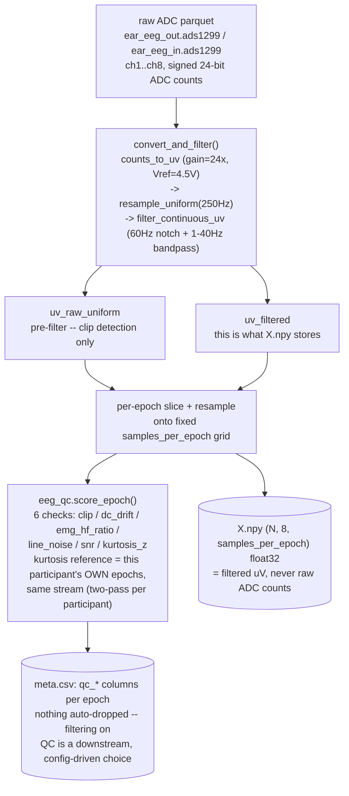
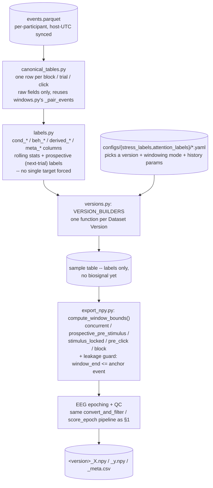

# Dataset Preprocessing & Label-Dataset Generation

Status: **working notes**, 2026-08-25. Covers the label-dataset generation
pipeline built on top of the canonical synced dataset
(`docs/Dataset_Sync_Design.md`): the shared EEG preprocessing/QC path,
`dataset/stress_labels/` and `dataset/attention_labels/`, the config-driven
Dataset Versions, and what each version is for. For the earlier EEG
signal-quality investigation this preprocessing path was validated
against, see `writeup/eeg_signal_analysis.mdx`. Preview locally with
`python docs/render_mdx_preview.py writeup/dataset_label_pipeline.mdx`.

## 1. EEG preprocessing + QC, shared by every `.npy` exporter

`writeup/eeg_signal_analysis.mdx` §2 documented *why* filtering must
happen on the continuous signal before epoching (a short epoch's filter
settling time dominates the result otherwise). That conversion
(`dataset/eeg_preprocess.py`) and QC scoring (`dataset/eeg_qc.py`) are the
shared, mandatory path for **every** EEG `.npy` export in the repo: the
original generic exporter (`dataset/export_npy.py`, covers
`emotion_trial`/`sart_trial`/`stroop_trial`/... and every other task key),
`dataset/stress_labels/export_npy.py`, and
`dataset/attention_labels/export_npy.py`.

Until this pass, `dataset/export_npy.py` read the EEG streams
(`ear_eeg_out.ads1299`, `ear_eeg_in.ads1299`) the same generic way as any
other stream — raw ADC counts straight into `X.npy`, no conversion, no
filtering, no QC. That's now fixed: both EEG streams get their own path.

Verified on real data: raw ADC codes span ±8.4M (signed 24-bit); the fixed
exporter's `X.npy` sits at a 99th-percentile amplitude of ~20µV, near-zero
mean — consistent with the signal-analysis doc's own numbers, and now
guaranteed by `tests/test_export_npy.py`.

## 2. Label-dataset generation: canonical tables → labels → versions → windows

`dataset/stress_labels/` (raindrop math + highway driving) and
`dataset/attention_labels/` (SART / Stroop / Schulte) both follow the same
four-stage pipeline, config-driven at the last step so a new dataset
variant is a YAML file, not new Python:

`build_datasets.py` (either module) builds the label tables +
per-task/tier QC reports; `export_npy.py` (either module) turns one
selected version into the epoched `.npy` files. Both CLIs require an
explicit `--version`/`--config` or `--all` — nothing builds by default.
Participant-level splitting (`stress_labels/splits.py`, shared by both
modules) never splits individual windows, only participant IDs; any
train-only fit (e.g. Stroop's RT residual, §3) is threaded through that
same split so val/test participants never leak into it.

## 3. Dataset versions at a glance

| Version | Task | Target(s) | # Labels | Task type | Resolution | Window mode | What it generates & why | Foundation-model use |
|---|---|---|---|---|---|---|---|---|
| `s0a_raindrop_baseline_vs_active` | raindrop math | `cond_stress_induction_binary` | 1 | binary classification | block | natural block span | Labels each block as resting baseline or active problem-solving — the coarsest possible split, for checking whether physiology tracks task engagement at all before attempting anything finer. | condition-decoding probe after self-supervised pretraining |
| `s0b_highway_baseline_vs_active` | highway | `cond_stress_induction_binary` | 1 | binary classification | block | natural block span | Same baseline/active split for the driving task, kept as its own version since raindrop (arithmetic) and highway (motor/visual) load the participant differently. | same, driving-task variant |
| `s0c_combined_baseline_vs_active` | both, pooled | `cond_stress_induction_binary` | 1 | binary classification | block | natural block span | Pools s0a+s0b's rows so one classifier is tested for a baseline/active split that generalizes across task type, not just within one. | cross-task condition-decoding probe |
| `s1a_raindrop_tiers` | raindrop math | `cond_task_pressure_tier` (1-3) | 1 | multi-class classification (3 classes) | block (active only) | natural block span | Labels active blocks by their 1/2/3 time-pressure tier — tests whether physiology scales with difficulty, not just task presence/absence. | multi-class difficulty probe |
| `s1b_highway_tiers` | highway | `cond_task_pressure_tier` (1-3) | 1 | multi-class classification (3 classes) | block (active only) | natural block span | Same tier-difficulty labeling for highway blocks (obstacle density/speed increases per tier). | multi-class difficulty probe |
| `s4_raindrop_behavior` | raindrop math | `beh_correct` / `beh_rt_sec` / `derived_deadline_fraction` | 3 | mixed — 1 binary classification (`beh_correct`) + 2 regression (`beh_rt_sec`, `derived_deadline_fraction`) | trial | trial span | One row per math problem with correctness/miss/RT/deadline-fraction kept as separate columns on purpose, so a rare "missed" class never becomes the only usable target. | multi-target regression/classification probe; RT-conditioned reconstruction |
| `s5_highway_behavior` | highway | `beh_collision` / `beh_reaction_margin_sec` | 2 | mixed — 1 binary classification (`beh_collision`) + 1 regression (`beh_reaction_margin_sec`) | obstacle (trial) | obstacle span | One row per obstacle with collision/near-miss/reaction-margin outcome — the event-level counterpart to s1b's block-level tier label. | fast-event regression probe; short-horizon reaction forecasting pretext task |
| `s6_highway_subjective` | highway | `subj_stress` / `subj_workload` / ... | varies (one `subj_*` column per questionnaire item) | ordinal regression per item (each `subj_*` is a self-report rating scale, not a class) | block (self-report) | natural block span | Attaches the participant's own post-block ratings — the only subjective/self-report labels in either pipeline, isolated here so they never mix into the behavior-only tables. | subjective-state probe (one label backs many windows — do not treat as independent) |
| `a1_sart_behavior` | SART | `cond_trial_type`, `beh_rt_sec`, `beh_correct`, commission/omission + rolling RT/error stats | 12 (2 condition + 3 binary outcome + 7 continuous rolling-history) | mixed — classification (`cond_trial_type`, `beh_correct`, commission/omission) + regression (`beh_rt_sec` + 7 rolling stats) | trial | concurrent (stimulus → +1s) | One row per digit with its go/no-go condition, concurrent outcome, and rolling RT-variability/error-rate history — the base behavioral table every other SART version builds on. | condition + behavior multi-target probe |
| `a2_sart_prospective_lapse` | SART | `derived_next_trial_{error,commission,omission,rt}` | 4 | mixed — 3 binary classification (`error`/`commission`/`omission`) + 1 regression (`rt`) | trial (rolling history) | prospective pre-stimulus (-5s → stimulus) | Same trials, but the label is shifted one trial forward and the window is forced to end before the next stimulus — so the target is "what happens next," not "what just happened." | **forecasting pretext task** — predict next-trial state from a pre-stimulus window, the closest thing here to an attention-lapse-prediction objective |
| `a3_stroop_behavior` | Stroop | `cond_congruency`, `beh_correct`, `beh_rt_sec` | 3 | mixed — 2 binary classification (`cond_congruency`, `beh_correct`) + 1 regression (`beh_rt_sec`) | trial | stimulus-locked (-1s → +2s) | One row per word with its congruency condition plus correctness/RT, kept separate so the rare-error class is never forced into being the sole target. | interference-effect probe; RT-conditioned reconstruction |
| `a4_stroop_rt_residual` | Stroop | `derived_stroop_rt_residual` (train-only fit) | 1 | regression only | trial | stimulus-locked (-1s → +2s) | Subtracts each trial's congruency/repetition-conditioned expected RT (fit on train participants only) from its actual RT, isolating a performance signal beyond "this trial happened to be incongruent." | continuous performance-residual regression probe |
| `a5_schulte_block` | Schulte | `beh_completion_time_sec`, `beh_misclicks` | 2 | regression only (both continuous, left un-binned) | block | natural block span | One row per grid attempt with raw completion time/misclicks, deliberately left continuous instead of cohort-median-split (which would make the label a function of the window's own length). | block-level regression probe (no cohort-median split — continuous target) |
| `a6_schulte_click` | Schulte | `beh_inter_click_interval_sec`, `beh_first_click_latency_sec` | 2 | regression only | click | pre-click (-2s → click) | One row per reconstructed click with the interval since the previous click — the fine-grained, leakage-safe alternative to a5's whole-block target. | fine-grained (sub-second) reconstruction/forecasting unit — smallest window size here, best fit for short masked-reconstruction pretraining spans |

None of these is a ground-truth "attention" or "stress" label by itself —
each is a specific, named condition or behavioral quantity (plan Rule
1-4). A foundation model pretrained (e.g. masked-window reconstruction)
on the pooled EEG epochs across all 14 versions can use any one of these
as a downstream linear-probe target without needing task-specific
preprocessing — the epoch shape, µV scale, and QC columns are identical
across every version (§1-2).
