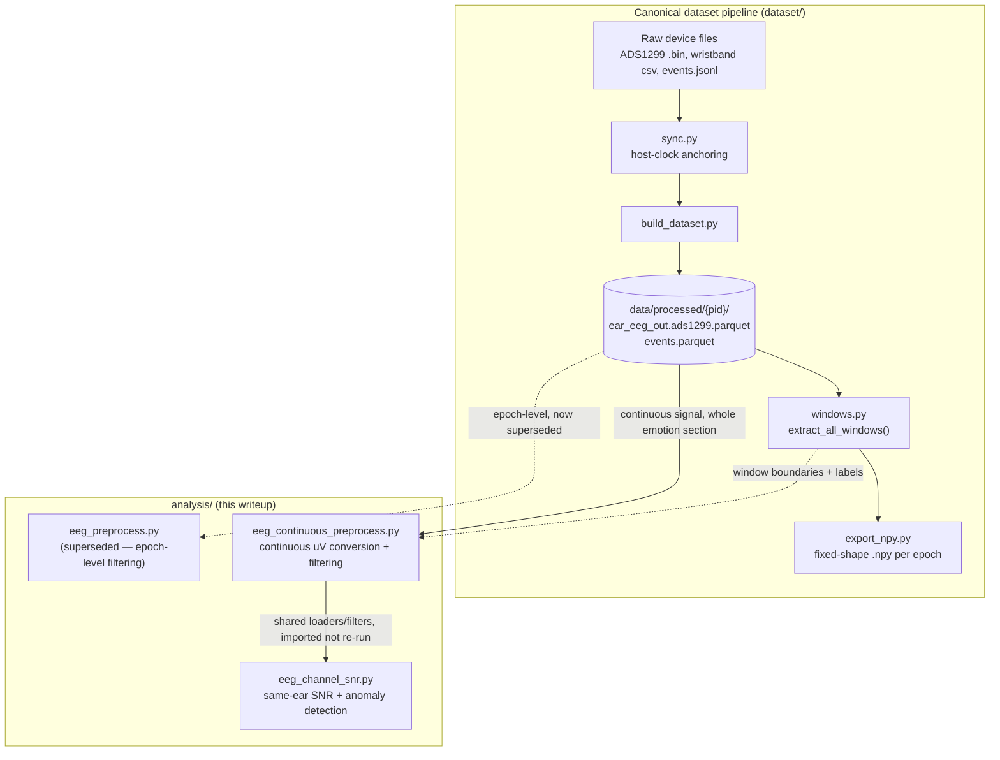
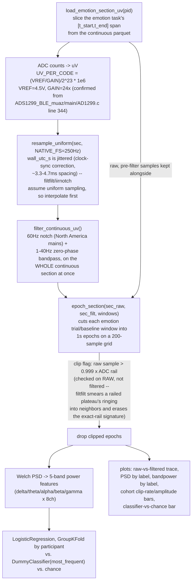
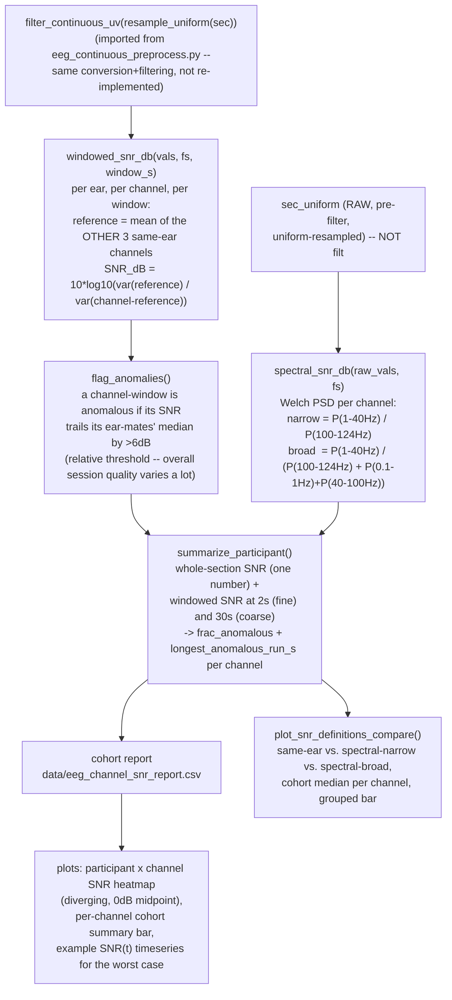
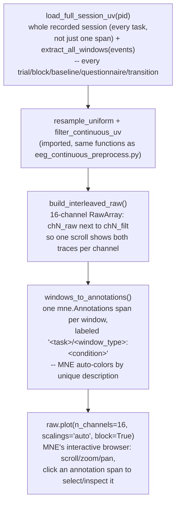
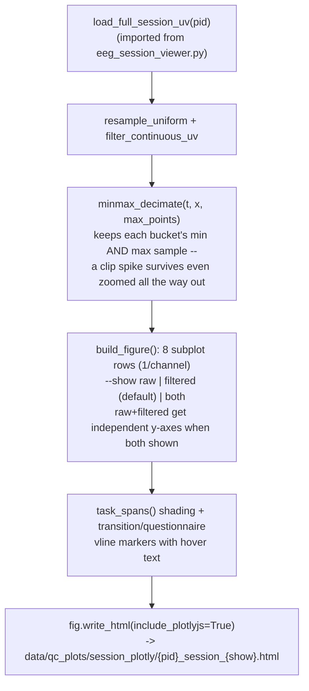

# Out-Ear EEG Signal Analysis — Code Flow & Findings

Status: **working notes**, 2026-08-25. Covers everything built in
`analysis/` while investigating why the foundation-model emotion
classifier scored near chance: continuous ADC→µV conversion/filtering,
same-ear SNR/anomaly detection, and the interactive session viewers.
Companion to `docs/Dataset_Sync_Design.md` (the canonical dataset
pipeline) and `writeup/dataset_label_pipeline.mdx` (label-dataset
generation, built afterward on top of the preprocessing this doc
validates). Preview locally with
`python docs/render_mdx_preview.py writeup/eeg_signal_analysis.mdx`.

## 1. Where `analysis/` sits relative to the canonical dataset pipeline

Everything here reads from the *already-synced* canonical Parquet
(`dataset/build_dataset.py`'s output) — it does not touch raw device
files directly. It exists to sanity-check the data **before** trusting a
downstream model's near-chance result.



**Why `eeg_preprocess.py` is superseded**: it filtered each already-cut
1-second epoch independently. A 1Hz-highpass Butterworth's settling time
is comparable to a 1-second window, so edge transients dominated the
result — not standard practice. `eeg_continuous_preprocess.py` replaced
it: convert → filter the *whole continuous recording* → **then** cut into
epochs.

## 2. `eeg_continuous_preprocess.py` — conversion, filtering, epoching



**Key numbers from this script** (17 participants, 9,986 emotion-trial
epochs before cleaning):

| Check | Result |
|---|---|
| Sanity check vs `dataset/export_npy.py`'s own epoching | 0 errors (bit-exact recompute) |
| Epochs dropped to ADC-rail clipping | 1,069 / 9,986 (10.7%) — concentrated in P017 (58%), P010 (52%), P003 (42%), P013 (23%) |
| Post-filter amplitude among raw-clean epochs | Median 2–13 µV (plausible), but 80–90% of "clean" epochs in P001/P006/P010/P017 still carry >500µV transients — filter ringing spreading from clipped stretches elsewhere in the same continuous recording |
| 3-class emotion classifier (bandpower features) | 36.3% ± 2.6% vs. 37.8% majority-baseline vs. 33.3% chance — **no signal above a majority-class baseline** |

## 3. `eeg_channel_snr.py` — same-ear SNR & anomaly detection

Rationale: ch1–4 sit on the left ear, ch5–8 on the right (confirmed from
`assets/sensor_attachment.jpg` — reference/bias electrode not used in
this setup). Electrodes on the same ear are close enough together that
they should track a shared physiological signal; a channel that doesn't
is either badly seated or has a hardware/wiring problem.



**Key finding — this is the strongest, most specific signal so far**:
cohort-median same-ear SNR ranks **ch5 (0.0dB) > ch2 > ch7 > ch3 > ch1 >
ch8 (-3.4dB) > ch4 (-7.1dB) > ch6 (-10.1dB)**.

- **ch6** (right ear): anomalous (>30% of 30s windows) in **11 of 17
  participants**, and its left-ear mirror **ch2** is one of the best
  channels (0.08dB, rarely flagged) — points at ch6 itself
  (wiring/connector/ADC channel), not a "this ear position is hard to
  seat" story.
- **ch4** (left ear, position 4) and its mirror **ch8**: anomalous in 8
  and 5 participants respectively — the second-worst spot, plausibly a
  shared mechanical/anatomical contact issue at that position on both
  ears.
- Anomalous runs for ch6/ch4 last 200–1000+ seconds (near session-long),
  not brief motion bursts — a **persistent**, not transient, problem.

**Spectral SNR disagrees with same-ear SNR on ch6 specifically** — see
section 4 below for why that disagreement is itself informative, not a
contradiction to resolve away.

## 4. The three SNR definitions, mathematically

Three independent ways of asking "is this channel trustworthy," each
sensitive to a different failure mode. A channel can pass one and fail
another — that disagreement is diagnostic, not noise.

### 4.1 Same-ear spatial leave-one-out SNR (`windowed_snr_db`)

For channel $c$ in ear group $E$ (the other 3 channels on the same ear),
over some time window:

```
reference_c(t) = mean of the OTHER 3 same-ear channels at time t
signal_power    = Var(reference_c(t))              -- shared, ear-consistent component
noise_power     = Var(x_c(t) - reference_c(t))      -- this channel's private deviation
SNR_spatial_dB  = 10 * log10(signal_power / noise_power)
```

**Assumption**: ch1–4 (left ear) / ch5–8 (right ear) sit close enough
together that real physiological EEG is shared across them (volume
conduction over a few cm), while electrode-contact noise, cable
artifacts, and local motion are channel-private and uncorrelated between
electrodes. So a channel that doesn't track its ear-mates is either badly
seated or wired wrong, independent of its own absolute amplitude. This is
the same principle behind the PREP pipeline's robust-average-reference
deviation for bad-channel detection (Bigdely-Shamlo et al., 2015) — we're
using a same-ear leave-one-out average instead of a full-montage robust
average, since we only have 4 electrodes per ear and no true reference.

**Failure mode it's blind to**: if *two* channels on the same ear go bad
*together* (a shared artifact source, e.g. both loosened by the same head
movement), each one's reference is contaminated by the other, which
deflates the noise estimate and inflates both SNRs — this masks a
correlated 2-channel failure. It's most reliable when only one channel per
ear is bad, which is what we actually observe (ch6 alone on the right).

### 4.2 Spectral SNR — narrow (`spectral_snr_narrow_db`)

Computed on the **raw, pre-filter** signal (never the already-bandpassed
signal — see caveat below). Welch PSD $S(f)$ per channel:

```
P_eeg   = mean(S(f) for f in [1, 40] Hz)      -- the EEG band we ultimately keep
P_noise = mean(S(f) for f in [100, 124] Hz)   -- near-Nyquist (fs=250Hz); no physiological
                                                  content reaches here, so this estimates
                                                  the pure electronic/instrumentation noise floor
SNR_narrow_dB = 10 * log10(P_eeg / P_noise)
```

**What it answers**: "is there more power in the EEG band than the
hardware's own noise floor contributes." A hardware-sensitivity check,
not a data-quality check — it only fails if the ADC/amplifier chain
itself is broken (dead channel, disconnected electrode reading pure
thermal noise). In our data it's high (35–49dB) on *every* channel,
including the ones we know are bad (ch6=48.8dB, the single highest) —
because ch6's problem isn't a quiet/dead channel, it's a channel picking
up something real but uncorrelated with its neighbors. This metric
essentially can't see that failure mode at all.

### 4.3 Spectral SNR — broad (`spectral_snr_broad_db`)

Same PSD, plus two contamination bands:

```
P_contam       = mean(S(f) for f in [0.1, 1] Hz)     -- sub-delta drift / DC offset wander
                + mean(S(f) for f in [40, 100] Hz)    -- EMG / movement / high-freq artifact
SNR_broad_dB   = 10 * log10(P_eeg / (P_noise + P_contam))
```

**What it answers**: "of the total power this channel is picking up, what
fraction is plausibly-clean EEG vs. drift+EMG+noise combined" — a
spectral-purity / contamination-budget check. In our data this is
strongly negative everywhere (-28 to -32dB): drift+EMG outweighs the
1–40Hz band by ~1000x on *every* channel, confirming the electrode-offset
problem documented in section 2 is cohort-wide, not channel-specific.
Notably it ranks **ch6 as least-bad** (-27.8dB) and ch5 as worst
(-31.9dB) — the *opposite* order from the spatial metric. Read together:
ch6's raw spectrum isn't unusually contaminated in isolation, it's
specifically *uncorrelated with its ear-mates* — consistent with a
wiring/connector-specific fault (picks up its own independent drift)
rather than a worse electrode-skin interface (which would show up as
worse spectral-broad SNR too, since a bad interface increases contact
noise and drift together).

**Caveat both spectral definitions share**: if an artifact's spectral
content actually overlaps the 1–40Hz band (e.g. broadband motion
artifact, or slow eye-movement-like drift that leaks above 1Hz), it gets
counted as `P_eeg` and neither definition flags it — they only catch
contamination that is spectrally *separable* from the EEG band, not
contamination that mimics it.

### 4.4 Why compute it on raw, not filtered, data

Running either spectral definition on the already-bandpassed (1–40Hz)
signal would be circular: the filter already zeroed out everything
outside [1,40]Hz, so `P_noise` and `P_contam` would be ~0 regardless of
actual data quality, and every channel would show enormous SNR. Only the
same-ear spatial metric is computed on filtered data, since its
comparison (channel vs. its own ear-mates) is meaningful either way.

## 5. Where every generated plot lives

All plots are regenerated by re-running the scripts (`data/` is
gitignored — regenerate, don't expect these to be checked in):

```bash
python -m analysis.eeg_continuous_preprocess   # -> data/qc_plots/continuous_preprocess/
python -m analysis.eeg_channel_snr             # -> data/qc_plots/channel_snr/
```

| Script | Plot file | What it shows |
|---|---|---|
| `eeg_continuous_preprocess.py` | `P{best,worst}_raw_vs_filtered.png` | 8-channel stacked trace, raw vs. filtered, for the cleanest and dirtiest (by clip rate) participant |
| | `psd_by_label.png` | Mean PSD (log scale) per emotion label (baseline/negative/neutral/positive) |
| | `bandpower_by_label.png` | Grouped bar: mean delta/theta/alpha/beta/gamma power per label |
| | `cohort_qc_summary.png` | Per-participant clip rate % and post-filter artifact rate % |
| | `classifier_vs_chance.png` | LogReg vs. majority-baseline accuracy, with a chance-level reference line |
| `eeg_channel_snr.py` | `snr_heatmap.png` | Participant x channel whole-section SNR, diverging color (blue=good, red=bad) around 0dB |
| | `channel_snr_summary.png` | Cohort median SNR per channel, sorted worst-to-best |
| | `P{pid}_{ear}_snr_timeseries.png` | SNR(t) for one ear's 4 channels in the single worst-affected participant, anomalous windows marked |
| | `snr_definitions_compare.png` | Cohort median SNR per channel, all 3 definitions side by side (spatial / spectral-narrow / spectral-broad) |

### Example: the ch6 pattern, visually


## 6. `eeg_session_viewer.py` — interactive whole-session browser

The plots above are all static, fixed-window snapshots. For "does this
signal actually look bad across a whole recording, not just a 5s
excerpt," that's the wrong tool -- so this script hands the whole
session to MNE's interactive Raw browser instead of matplotlib.



Usage:

```bash
python -m analysis.eeg_session_viewer --pid P001
```

Interaction, once the window opens: mouse wheel / arrow keys to scroll in
time, `+`/`-` to rescale amplitude, page up/down to jump a full window,
click a colored annotation span (top bar) to select/inspect it. Requires
a local display (not runnable headless); install `mne-qt-browser` (a
PyQt5 dependency) for a much smoother scroll/zoom than the plain
matplotlib fallback -- both are already installed in this environment.

A P001 smoke test: 57.3 minutes recorded, 1,317 annotated windows across
every task (`attention_highway/trial` x1108, `stress/trial` x74,
`attention_focus_stroop/trial` x48, `transition` x28,
`preparation/questionnaire` x13, `emotion/trial` x10, plus every
block/baseline/self_report kind) -- confirming the annotation extraction
covers the whole session, not just the emotion task this writeup's other
two scripts focus on.

## 7. `eeg_session_plotly.py` — self-contained HTML alternative

Built after the MNE Qt browser turned out hard to read clearly over X11
forwarding: MNE shares one amplitude scale across all "eeg"-typed
channels, so raw (~$10^5\mu V$ swings) and filtered (~$10^3\mu V$) can't
both be legible at once regardless of zoom. This script renders one
static, self-contained HTML file per participant instead — no server, no
X11, just open the file in any browser.



```bash
python -m analysis.eeg_session_plotly --pid P001               # filtered only (default)
python -m analysis.eeg_session_plotly --pid P001 --show raw
python -m analysis.eeg_session_plotly --pid P001 --show both    # raw+filtered, dual y-axis
```

## 8. Open questions / next QC ideas to discuss

Things the current pipeline does **not** yet check, worth deciding on
together before spending more time:

- **Cross-ear correlation, not just same-ear.** If ch1–4 and ch5–8 turn
  out to be *highly* correlated with each other too (not just within an
  ear), that's a red flag for common-mode noise (power-line coupling,
  a shared ground/reference issue) rather than real bilateral brain
  signal — real EEG is usually more asymmetric between the two ears than
  a shared artifact would be.
- **Windowed spectral SNR.** Right now spectral SNR is whole-section only;
  same fine/coarse windowing we already do for spatial SNR would tell us
  whether the drift/EMG contamination is constant or session-phase
  dependent (e.g. worse during `attention_highway` movement vs. `emotion`
  passive viewing).
- **Time-into-session trend.** Does SNR degrade monotonically over the
  ~60min session (electrode drying out / adhesive failing) — worth a
  simple SNR-vs-elapsed-time regression per channel, independent of task.
- **Robust (median/MAD) variants of the spatial SNR**, since `Var()` is
  sensitive to the same outlier bursts we're trying to detect — a channel
  with one huge transient can distort its own noise estimate independent
  of its steady-state quality.
- **A composite per-channel-per-participant QC flag** combining clip rate
  + spatial SNR + spectral-broad SNR into one exclusion mask, fed forward
  into `export_npy.py` / the classifier pipeline directly, instead of
  living only as a side analysis.
- **ICA or regression-based artifact removal** for ch6/ch4 specifically,
  as an alternative to dropping them outright — worth trying only if the
  channel's problem is a removable common source (e.g. a specific motion
  axis) rather than genuinely dead/misseated hardware.

## 9. Standing practice going forward

Every analysis script in `analysis/` now saves its diagnostic plots to
`data/qc_plots/<script_name>/` and prints `Saved: <path>` for each one —
raw vs. processed traces, PSD, band power, and the relevant QC metric
(clipping, amplitude, SNR) are treated as required output, not optional.
Plot styling (`analysis/plot_style.py`) uses the validated categorical/
diverging palette from the `dataviz` skill so channel/label colors stay
consistent across scripts (e.g. `ch6` is always the same color in every
plot it appears in).

The per-epoch conversion/filtering this doc validates
(`dataset/eeg_preprocess.py`, `dataset/eeg_qc.py`) is now the shared,
mandatory path for every `.npy` exporter in the repo — see
`writeup/dataset_label_pipeline.mdx` §1 for how that plugs into label
generation.
